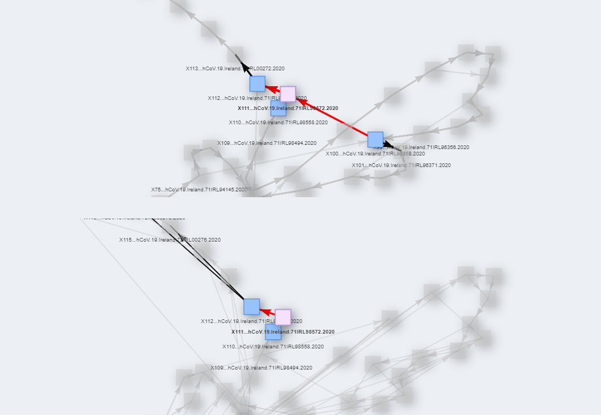
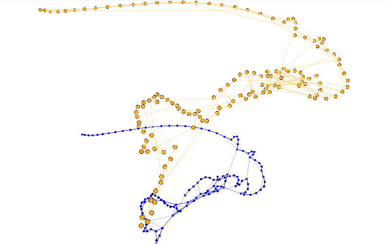

# TICEpiBoard

## Links

#### https://dirkprograms.shinyapps.io/EpiBoard2D/
#### https://dirkprograms.shinyapps.io/EpiBoard3D/

## Code

These files only contain the code to run the application, no data.
 
To see an implementation of these, click the links above.

## 2D vs 3D Implementations

The 2D version was made using visNetwork. I wanted interactivity between the two 
 
graphs, and visNetwork allowed me to highlight the same node on both networks.
 
When using this version, I suggest enabling the **Hovering Animation** checkbox.

The 3D version was made using three.js. This one allows the ability to view the 
 
two networks ontop of each other in 3D space, however there were some issues 
 
as I was unable to make the two graphs appear closer, and there was no easy way 
 
of implementing interactivity.

## Images

